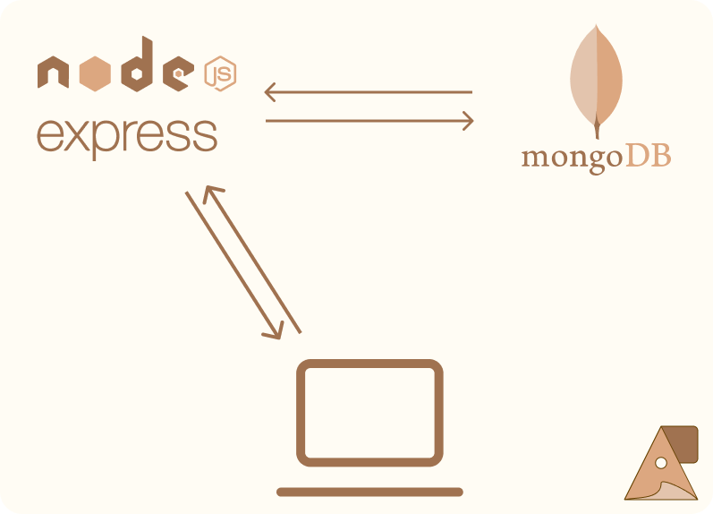

# Tutorial de Express y mongoose
Hola, soy Javier Sabando y en este pequeño tutorial busco que aprendas a crear una arquitectura backend, con base en JavaScript ES6

## Algunass pautas 
* Usaremos ES6
* En el momento del tutorial estoy usando node v18.16.0 </br>
_Trata de usar [nvm](https://github.com/nvm-sh/nvm) para manejar tus versiones de node_
* npx para reutilizar paquetes </br>
```bash
npm install -g npx
```

## Dependencias
* bcryptjs
* cors
* dotenv
* express
* jsonwebtoken
* mongoose
* morgan
* nodemailer

## Arquitectura

### Carpetas
>.env       </br>
index.js    </br>
package.json</br>
src/
>> controller/  </br> 
messages/       </br> 
middlewares/    </br> 
models/         </br> 
routes/         </br> 
utils/          </br> 
app.js          </br> 
config.js       </br> 
bd.js           </br> 
### Servicios
